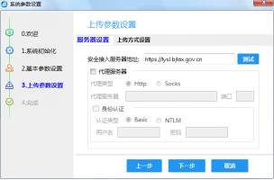
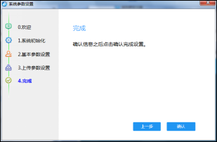
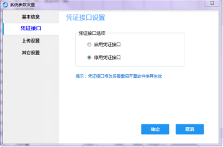
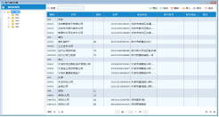

# 航信税控开票操作手册

税控发票开票软件（金税盘版）V2.0

简化版手册

目      录.

第一章 系统安装与启动7

第二章  系统登录11

第三章  系统设置17

3.1基本参数设置18

3.2 编码管理21

3.2.1客户编码22

3.2.2商品编码23

3.2.3商品和服务税收分类编码26

3.3 报税盘注册30

3.4 打印模板参数设置31

第四章  发票领用及读入35

4.1金税盘、报税盘领票35

4.2网上领票37

第五章  发票填开39

5.1填开正数发票39

5.2 已开发票查询65

第六章  报税处理73

6.1办税厅抄报73

6.2上报汇总管理75

第一章 系统安装与启动

操作步骤：

【第一步】将金税盘通过USB数据线连接到计算机的USB接口，系统会自动找到新硬件，并自动完成金税盘驱动程序安装，无需手工安装。金税盘驱动安装完成后会在计算机的设备管理器中出现“AISINO JSP shuikong USB Device”的标识，如图1-1所示。

图1-1设备管理器中金税盘设备

【第二步】双击安装文件夹中的安装程序图标，如图1-2所示。系统运行安装向导，然后按照提示逐步完成安装。

 

图1-2安装程序

说明：

① 在开票软件的安装过程中，系统会提示用户输入6-20位纳税人识别号和开票机号，如图1-3所示。若金税盘已连接，则系统自动从金税盘中读取企业税号和开票机号，无需用户手工输入。若税号或开票机号输入错误，则无法进入系统，只能重新安装开票系统。在系统注册中的企业税号和开票机号取自这里输入的信息，无法更改。

图1-3输入纳税人识别号和开票机号

② 点击“下一步”后的提示信息如图1-4所示，此时需按发行通知书上的地区编号正确输入。若金税盘已连接，则系统自动从金税盘中读取地区编号，无需用户手工输入。

图1-4提示输入地区编号

③ 在开票软件的安装过程中，可以通过点击图1-5中的“浏览”按钮，在弹出的选择文件夹窗口中修改系统默认的安装路径。

图1-5选择安装路径对话框

④ 开票软件安装包运行后会自动检测系统中是否已经安装Microsoft .NET Framework 4.0或以上版本，如果检测未安装，开票软件会自行安装（已集成在开票软件安装程序内，无需用户手工下载安装）。

【第三步】安装完开票软件后，会在桌面上出现“开票软件”快捷图标，如图1-6所示。操作人员可直接双击快捷图标启动开票软件，无需重新启动计算机。

1-6桌面快捷方式

第二章  系统登录 

        为了保证系统数据的安全性，本系统建立了操作员管理体系和系统登录机制。凡是合法操作人员，应将其操作权限级别与身份添加到本系统操作员管理数据库中，且每个操作员都设有自己的登录口令。只有身份合法且口令正确时才可以登录本系统。

【第一步】双击桌面上的“开票软件”快捷图标，如图2-1所示。

图2-1开票软件图标

【第二步】启动系统进入税控发票开票软件（金税盘版）登录界面，如图2-2所示（图中显示开票软件版本号，此图为示意图，实际软件版本号以所安装软件为准）。

 图2-2 用户登录对话框

【第三步】在“用户名”一栏的下拉列表框中选择一个用户，在“密码”栏中输入密码，管理员默认密码为123456；在“证书口令”中输入税务数字证书口令（默认为88888888），点击“登录”按钮后，系统弹出修改证书口令窗口，如图2-3所示，用户必须正确设置新的证书口令方可进入开票软件。在以后的使用过程中，也可通过点击登录界面的“更改证书口令”来修改证书口令。

图2-3修改证书口令窗口

【第四步】正确设置新的证书口令后，系统启动并开启金税盘，金税盘开启成功后弹出系统参数设置界面，如图2-4所示。用户可根据此向导来完成系统初始化以及基本参数设置等操作。

图2-4系统参数设置

【第五步】在图2-4界面点击“下一步”按钮，进入系统初始化界面，用户可在此设置主管姓名和用户密码等，如图2-5所示。

图2-5系统参数设置

        此功能将对账套进行重置操作，重置后除保留企业各项基本信息和编码信息外，其他数据全部删除且不可恢复，系统恢复到当前会计期间的初始状态。

【第六步】完成系统初始化以后，点击“下一步”按钮，进入基本参数设置界面。用户在此填写营业地址、电话号码和开户行及账号。如图2-6所示。

图2-6基本参数设置

【第七步】完成基本参数设置以后，点击“下一步”按钮，进入上传参数设置界面。安全接入服务器地址会根据企业所属六位地区编码自动匹配，如果后续发生变化也可以手工修改。如通过代理服务器上网，可勾选“代理服务器”选项，根据用户实际情况进行进一步设置，如图2-7所示。

图2-7上传参数设置

【第八步】点击“测试”按钮来测试开票电脑是否与安全接入服务器连通，如图2-8所示。

图2-8上传参数设置成功

【第九步】测试连通以后，点击“下一步”按钮，进入完成界面，至此开票软件系统初始化和系统参数设置操作已完成，如图2-9所示。

图2-9完成初始化设置

【第十步】点击提示框中的“确认”按钮，进入系统主界面，如图2-10所示。

]
图2-10系统参数设置

    系统主界面由菜单栏、工具栏、编辑区和状态栏四部分组成，工具栏包含防伪开票业务处理的四个功能模块：系统设置、发票管理、报税处理和系统维护。用户从工具栏选择相应的功能模块后，操作界面即变为用户所选模块的功能窗口，菜单栏切换为该模块对应的功能菜单。

第三章  系统设置

        本模块用于对系统进行初始化与初始数据设置。同时，可利用该模块中的编码管理功能对各种编码进行设置和修改。

通过点击系统主界面工具条上的“系统设置”按钮，便可以打开“系统设置”模块，如图3-1所示。该模块的功能菜单列于主窗口菜单上，其常用的菜单功能及基本流程则以导航图的形式显示于编辑区内。

]
图3-1系统设置模块

  本模块的菜单结构如图3-2所示。

图3-2系统设置模块菜单结构

3.1基本参数设置

在系统登录过程中，系统已按照向导完成系统初始化以及基本参数设置等操作，若需修改基本参数等，则可利用该功能进行修改。基本参数设置包含“基本信息”、“凭证接口”、“上传设置”和“其它设置”四个设置项。

操作步骤：

【第一步】点击“系统设置/系统参数设置/基本参数设置”菜单项，或直接点击导航栏中的“参数设置”按钮，便弹出系统参数设置对话框，如图3-3所示。

图3-3基本参数设置

在“基本信息”页签中可修改营业地址、电话号码、开户行及账号，修改完成后点击“确定”按钮将关闭窗口并保存信息。

2 说明：

① “纳税登记号”和“企业名称”信息取自企业金税盘中，若需更改企业名称时，必须携带企业金税盘到税务机关进行改写。

② 与金税盘有关的信息由系统调用金税盘内部信息自动填写，用户无法修改。 

③ 在基本信息中，营业地址、电话号码和开户行及账号需手工输入。

④ 多个开户行及账号的输入方法：在一个银行账号输入结束后，按回车键将光标移到下一行，继续输入下一个账号，依次可以输入多个账号。

【第二步】点击左侧菜单栏中的“凭证接口”，此功能用于开启和关闭凭证接口（系统默认为关闭状态，此功能仅当用户使用ERP软件时方需开启，开启后的相关功能本手册中不介绍），选择后点击“确定”按钮保存，重启开票软件后设置生效。如图3-4所示。

图3-4凭证接口

【第三步】点击左侧菜单栏中的“上传设置”，默认安全接入服务器地址是根据企业所属六位地区编码自动匹配的发票上传地址，如果税务局对该地址进行了变更，用户需要修改安全接入服务器地址，如图3-5所示。如有代理服务器，可以勾选“代理服务器”选项，根据实际情况进行进一步设置。

图3-5上传设置

【第四步】设置完成后首先点击“测试”按钮来测试是否连通，如图3-6所示，之后再点击“确定”按钮保存。

图3-6测试连接成功提示

【第五步】点击“其它设置”，进入其它参数设置界面，默认地址是根据企业所属六位地区编码自动匹配的增值税发票查询系统地址，如果税务局对该地址进行了变更，用户需要手工修改此地址，才可通过“帮助-登录增值税发票查询系统”按钮进入增值税发票查询系统，如图3-7所示。

图3-7 其他参数设置

3.2 编码管理

主要功能：编码管理功能主要用来完成对各种编码的设置和修改，鉴于各种编码的设置方法基本相同，此章节仅以“客户编码”、“商品编码”、“商品和服务税收分类编码”为例进行介绍。

3.2.1客户编码

客户编码主要用来录入与企业发生业务关系、需要为其开具发票的客户信息，也可以对已录入的客户信息进行修改和删除。填开发票时，“购方信息”可以从该客户编码库中选取。

操作步骤：

【第一步】点击“编码管理/客户管理”菜单项，便弹出“客户编码设置”窗口，如图3-7所示。

 图3-7客户编码设置

【第二步】在“客户编码设置”窗口中，点击工具条中的“增加”按钮，弹出“客户编码”添加窗口，如图3-8输入客户信息，带*号的为必填项，数据输入完毕，点击 “保存”按钮，客户添加成功。同样也可以用工具条中的“修改”、“删除”按钮对客户编码进行编辑。

图3-8客户编码添加

2 说明

如用户需要对客户进行分区或分类管理可以使用编码族管理。

编码族管理：用于显示分级编码的树状结构，并可对各编码族整体进行编辑操作，如图3-9所示。

  

图3-9编码族管理器

3.2.2商品编码

主要功能：用来录入本企业所销售的商品信息，也可以对已录入的商品信息进行修改和删除。填开发票时，“商品信息”可以从该商品编码库中选取。 

操作步骤：

【第一步】点击“编码管理/商品管理”菜单项，便弹出“商品编码设置”窗口，如图3-10所示。

图3-10商品编码设置窗口

【第二步】在“商品编码设置”窗口中，可以对商品编码数据进行增加、修改、删除等一系列编辑操作。操作方法如下：

1.增加商品：

a.点击工具条中的“”按钮，弹出商品编码添加窗口，如图3-11所示。

图3-11商品编码添加

 b.点击“上级编码”栏选择商品所属分类，“编码”会自动依序产生同级的商品编码。

c. “简码”栏可以输入商品的缩写如：打印机简码录为DYJ，在发票填开界面直接输入DYJ就可以调出此商品。用户可以自定义简码，必须由大写字母打头，最大长度为6个字符，也可以省略不填。

d.输入商品名称、规格型号、计量单位、单价等各项信息，带*的项为必填项。

e.选择含税价标志： 指定“单价”是含税或不含税。只有“是”与“否”两种取值，分别表示含税单价与不含税单价。可通过该栏目中的按钮进行切换，系统默认为“否”，不含税单价。

f.隐藏标志：是为隐藏，否为不隐藏。

g.在“税收分类编码”栏输入商品名称模糊查询到对应的税收分类编码，单击要选择的编码，赋码成功，或者单击“税收分类编码”栏“”按钮，显示税收分类编码列表，可以通过检索框输入商品名称，快速找到对应的税收分类编码双击，即赋码成功。赋码成功后，“税收分类名称”、“税率”栏会自动显示对应名称和税率。

h.如果添加的商品享受优惠政策，则“享受优惠政策”项变为可修改状态，通过下拉箭头选择“是”，选择优惠政策类型。

i.点击左上角“保存”按钮，系统提示“保存成功”。商品编码列表中将显示税收分类编码是否享受优惠政策，如图3-12所示。

图3-12添加成功

2.删除商品：首先选中要删除的商品记录，然后点击工具条中的  “”按钮，便可以删除这条记录。

% 注意：

只能删除不含下级的编码，即末级编码。

3.编码族管理方法：与客户编码族管理方法完全相同。

3.2.3商品和服务税收分类编码

主要功能：国家税务局为实现对商品信息的统计、核算和管理，统一编制了商品和服务税收分类编码，此编码由国家税务总局统一维护并预置在开票软件中，企业个人不能自行进行编辑修改。

税收分类编码更新提供两种方式：网络更新和手工导入。

1、网络更新

启动开票软件时，如果计算机是联网状态，系统会自动同步税局端的编码信息，完成更新，若在开票过程中，发现当前的税收分类编码信息表不是最新的，可以通过“商品和服务税收分类编码”界面的“更新”功能进行数据同步。

操作步骤：

【第一步】进入开票软件后，点击“编码管理/商品和服务税收分类编码”菜单，显示系统当前的税收分类编码信息，如图3-13所示。

图3-13商品和服务税收分类编码

【第二步】在“商品和服务税收分类编码”界面（如图3-13所示）点击“更新”按钮，系统将与税局端提供的税收分类编码进行数据同步，并将最新的税收分类编码表下载到本地，如图3-14所示。

 图3-14税收分类编码表更新过程提示

   说明：如果税收分类编码没有变化，执行“更新”操作时，系统提示“没有需要同步的商品和服务税收分类编码信息。”，如图3-15所示。

 图3-15更新提示

2、手工导入

    当开票软件处于离线状态时，可以通过税局提供最新的“商品和服务税收分类编码表”文件，在开票软件中通过“导入”功能将税收分类编码导入到系统中。

操作步骤：

【第一步】在“商品和服务税收分类编码管理”界面(如图3-13所示），点击“导入”按钮，系统显示“编码导入”界面，如图3-16所示。

图3-16编码导入

【第二步】点击“浏览”按钮，选择“商品和服务税收分类编码表”文件，选择完成后，点击“确定”按钮，系统将税收分类编码导入到系统中。显示传入报告，如图3-17所示。

图3-17传入报告

 【第三步】点击右上角“”关闭按钮，系统显示更新后的税收分类编码信息，如图3-18所示。

图3-18税收分类编码

3、税收分类编码查询

操作步骤：

【第一步】税收分类编码成功导入到开票软件后，在“编码管理”菜单下，选择“商品和服务税收分类编码”菜单，系统显示详细税收分类编码信息。

【第二步】可通过点击左侧的分类目录树，逐级查看商品的分类信息，也可以通过快速查找方式，在“检索”框内输入商品信息，点击“检索”按钮将快速查找商品对应的编码，如图3-19所示。

图3-19分类编码检索

说明：

① 税收分类编码只能进行查询，不能进行增加、修改和删除操作。

② 只有“汇总项”的值为“N”的税收分类编码，在商品编码编辑时才可以被选择（电信行业除外），如图3-20所示。

③ 在编辑商品编码时，税收分类编码为必选项，如果不选则无法保存如图3-21所示。

3-20商品和服务税收分类编码

图3-21无税收分类编码的错误提示

3.3 报税盘注册

主要功能：对于配有报税盘的企业，在开票系统中初次使用报税盘时，必须先注册报税盘。

操作步骤：

【第一步】将报税盘通过USB数据线直接插在计算机的USB接口即可，无需安装驱动程序。报税盘安装成功后，可在计算机设备管理器中查看设备状态，如图3-22所示。

图3-22设备管理器中报税盘标识

【第二步】点击系统设置模块“系统设置”菜单下的“报税盘注册”功能对报税盘进行注册，只有注册成功的报税盘才可在开票系统中正常使用。

% 注意：

对于仅使用金税盘的用户，金税盘可以实现购退票、开票和抄报税等所有功能。对于使用金税盘和报税盘的用户，报税盘主要作用是购退票、抄报税和到税务机关修改购票员信息。

3.4 打印模板参数设置

主要功能：通过打印测试的方式对发票、清单及信息表的模板进行设置。

可设置模板包括：增值税专用发票模板、增值税普通发票模板、货物运输业增值税专用发票模板、旧版机动车销售统一发票模板、新版机动车销售统一发票模板、发票清单模板、红字增值税专用发票信息表模板、红字货物运输业增值税专用发票信息表模板。

鉴于各种模板的设置方法相同，此章节仅以“增值税专用发票模板”设置方法为例进行介绍。

操作步骤：

【第一步】点击“系统设置/参数设置/增值税专用发票模板设置”菜单项，弹出“打印设置”窗口，如图3-23所示。

图3-23打印设置

【第二步】选择默认打印机型号。

【第三步】录入打印调整的边距值，以毫米为单位。如录入数值为正数，则为同向调整，如果录入数据为负数则为反向调整。例：“向下调整”项目录入“5”，则代表发票打印内容整体向下调整5毫米；如“向下调整”项目录入“-5”，则代表发票打印内容整体向上调整5毫米。

【第四步】所选默认的打印机中放好空白纸或票样，点击“打印”按钮。

【第五步】根据打印票样的实际情况如需再次调整可重复以上步骤。

【第六步】：打印模板调整满意后，可以点击“预览”、“打印”或“不打印”任一按钮保存所修改的设置内容。

2 说明：     

        每种模板可分别保存指定的默认打印机及边距调整值，各模板间的设置互不影响。调整设置后，点击“预览”、“打印”或“不打印”任一按钮均可保存所修改的设置内容。

第四章  发票领用及读入 

4.1金税盘、报税盘领票

主要功能：利用金税盘或报税盘作为购票介质，在税局办理购票并读入企业端开票系统。

操作步骤：

【第一步】首先持本机金税盘或报税盘到税务局领取发票，再将金税盘或报税盘连接到本机USB接口上，进入开票软件。

【第二步】点击“发票管理/发票领用管理/读入新购发票”菜单项，系统弹出“您确定要从金税设备读取发票吗？”提示信息框，单击“是”按钮，系统弹出读入介质选择提示框，如图4-1所示，选择读入发票来源介质（如果没有注册报税盘则不会有此提示），系统便读取金税设备购票信息。如果读入成功，则购票信息记入本机金税盘中，并显示发票读入成功的提示信息，如图4-2所示。

图4-1读入发票的来源介质选择

 
图4-2发票读入成功窗口

2 说明：

① 税务机关发售的电子发票种类包括增值税专用发票、增值税普通发票、电子增值税普通发票、增值税普通发票（卷票）、货物运输业增值税专用发票、机动车销售统一发票共六种发票，纸质发票是五种，使用时需加以区分。其中，增值税专用发票和增值税普通发票需要在防伪税控税务端系统领用，货物运输业增值税专用发票、机动车销售统一发票、电子增值税普通发票和增值税普通发票（卷票）需要在货运税控系统的税务端领用。企业实际可领用的发票种类取决于税务端的授权。

② 领用某一类发票时的一个连续号码段称之为1卷，使用金税盘和报税盘领用发票的最大卷数不同：使用金税盘领用发票时，专用发票与普通发票之和不能超过5卷，货物运输增值税专用发票与机动车销售统一发票之和不能超过5卷，电子增值税普通发票和增值税普通发票（卷票）之和不能超过5卷，六种发票卷数之和不能超过10卷。使用报税盘领用发票时，最多只能领用5卷不同种类的发票。

③ 系统会将金税盘或报税盘中领用的多卷多种类发票一次性读入金税盘。在发票读入成功的提示框中会显示出读入的各卷发票的基本信息，包括发票种类、开票限额、类别代码、类别名称、起始号码、发票张数和领购日期。

④ 如下情况将不能成功读入发票：

a.未插入金税盘或报税盘或插入的不是本机金税盘或报税盘。

b.金税盘或报税盘中无领购或分配的发票，或发票流水号已读走。

c.金税盘已到锁死期，不能读入发票。

d.未注册报税盘（如领购发票使用的介质是报税盘）。

4.2网上领票

主要功能：通过网络方式下载发票信息。

操作步骤：

【第一步】用户到税务局领用纸质发票。

【第二步】进入开票软件点击“发票管理/发票领用管理/网上领票”菜单项，系统弹出“网上领票”提示框，选择购票起止日期，点击“查询”按钮，系统将列示所选期间段的购票信息，提示如图4-3所示。

图4-3网上领票窗口

【第三步】勾选需要下载的发票卷，点击“发票下载”按钮，则用户在税局所领用的并被勾选的电子发票信息自动读入到用户的金税盘中。

2 说明：

①  网络领票方式，需要保证网络环境通畅。

②  与金税盘或报税盘领用方式不同，领用电子发票不受发票卷数的限制。

③  如果发票下载不成功，建议使用手工下载方式，点击“手工下载”按钮，提示如图4-4所示，选择发票类型，录入：发票代码、起始号码、发票张数，点击“下载”按钮，完成手工下载。

④ 电子增值税普通发票仅可使用手工下载方式。

图4-4手工下载窗口

第五章  发票填开 

        主要功能：企业用来填开和打印各种发票，发票填开功能是开票软件的核心功能。

5.1填开正数发票

（一）增值税专用发票和增值税普通发票

增值税专用发票和增值税普通发票的正数发票填开方法相同，以下仅以正数增值税专用发票为例进行介绍。

操作步骤：

【第一步】点击图5-1中的“发票管理/发票填开/增值税专用发票填开”菜单项，系统弹出“发票号码确认”提示框，如图5-2所示。

 图5-1 发票填开菜单

2 说明：

发票填开菜单中显示出的下级子菜单内容和企业授权开具的发票种类有关。对于授权只开具增值税专用发票和增值税普通发票的单营户而言，下级子菜单中无其他填开菜单。

 图5-2 发票填开号码确认窗口

2 说明：

① 在填开各种发票时，系统自动根据所要开具的发票按顺序弹出同种类待开具发票号码确认窗口。

② 当系统具有多卷同种类发票时，默认按卷号顺序调用发票。即当前一卷发票开具完后，系统自动调出下一卷同种类发票进行填开。

【第二步】在图5-2中点击“确认”按钮，系统弹出“增值税专用发票填开”窗口，如图5-3所示，该窗口的格式与实际票面格式基本相同。

图5-3 发票填开窗口

2 发票填开窗口结构说明：

① 工具条：具有通用的功能按钮和数据编辑键。

② 发票填开界面：由以下三个主要组成部分：

a) 购方（客户）信息区域：用于填写购方有关信息。

b) 商品信息区域：用于填写所售商品详细信息以及清单和折扣等。

c) 其它信息：销售方（本单位）信息、发票号码、开票日期、密文、备注栏、开票人等。这些信息除备注之外，皆由系统生成，无需用户填写。收款人、复核两项可以通过下拉箭头选择。

【第三步】填写购方信息，方法如下：

方法一：客户编码库中取数据。点击“名称”或“纳税人登记号”编辑框右侧的按钮，便弹出“客户选择”窗口，如图5-4所示。选取一个客户并双击，则本条客户信息便写入发票界面的购方信息栏。

图5-4 客户选择窗口

2 说明：

    系统支持对输入信息的模糊匹配，用户可以在图5-4上方的检索框内输入信息，系统自动显示匹配的内容，用户可以方便地从匹配的内容中选择，从而提高了工作效率。

方法二：直接填写。“名称”项最大长度为100个数字字母或50个汉字；“税号”可以为6-20位的数字或字母，普票税号可以为空；“地址电话”与“开户行及账号”均可打印100个数字字母或50个汉字。名称和纳税人识别号均支持模糊查询匹配以便于用户输入。

2 说明：

若用户填开发票时的客户信息不在客户编码库中，则用户可以在客户信息的各文本框中直接输入相应信息，用此方法输入的客户信息并不能直接添加到客户编码库中，但可以通过发票填开窗口中的“”按钮将其添加保存在客户编码库中。

保存客户信息有两种方式，分别是手工保存和自动保存。两种方式可通过点击“”按钮在弹出的菜单中进行设置。手工保存需要用户每次输入完客户信息后，手动去点击“客户/手工保存”按钮来保存客户信息；而自动保存即每次有新的客户信息系统自动保存。

手工保存具体方法如下：

① 在客户信息的各文本框中直接输入相应信息。

② 点击“客户/手工保存”按钮，系统弹出是否有上级单位的对话框，如图5-5所示。

 

图5-5 系统提示框

③ 如果该客户信息没有上级单位，点击“否”按钮，系统会直接将其作为一级编码保存在客户库中。如果该客户信息有上级单位，点击“是”按钮，系统会弹出客户编码库，如图5-6所示。

图5-6 客户编码库

④ 在客户编码库中双击上级单位编码行，客户信息就会添加在上级单位所在编码下，并按顺序编号，同时弹出新增客户编码成功的提示框，如图5-7所示。

 

图5-7 成功提示框

⑤ 在图5-7中点击“确认”按钮，结束添加客户编码操作。

【第四步】填写商品信息，具体操作方法分为以下几种情况：

第一种：不带清单和折扣的发票：

1. 点击“商品名称”编辑框右侧的按钮，便弹出“商品编码选择”窗口，用户可从中选取一种商品，然后双击之或点击工具条上的“选择”按钮，则本条商品的名称、规格型号、单位、单价和税率等信息便写入发票界面的商品信息行。其中“单价”数值可以修改，“税率”可从下拉框中选择“0%、1.5%、3%、4%、5%、6%、11%、13%、17%、中外合作油气田”等税率。中外合作油气田版发票只能通过此处选择“中外合作油气田”税率来开具。

2. 在“数量”一栏填写销售本商品的数量，然后按“回车”键，系统会自动计算出金额、税额和价税合计金额。

3. 如选择的商品没有赋予税收分类编码，则会弹出商品编码添加窗口，如图5-8，添加税收分类编码保存后，方可正常调用此商品编码，此类商品如果享受优惠政策，在“享受优惠政策”选项选择“是”，在“优惠政策类型”选择对应的类型，例如：“免税”，税率会自动调整为匹配的优惠税率，不享受优惠政策的商品类，“享受优惠政策”项为灰色不可选。

图5-8添加税收分类编

2 说明：

① 商品行中的“数量”和“金额”两项之一须由用户填写，若只填写一项，则另一项通过与“单价”的计算自动得出；若两项都填写，则“单价”项将通过这两项的计算而自动得出。“税额”项则由系统自动算出，无法修改。

② 可以使用工具条中的数据编辑键插入或删除商品行，亦可以通过键盘上的向下方向键增加一行商品信息，但总行数不能超出本类别发票所允许的最大开具行数(汉字防伪企业允许的最大开具行数为7行，非汉字防伪企业允许的最大开具行数为8行)。

③ 商品名称不可为空，最多可输入92个数字字母或46个汉字，汉字防伪发票的商品名称最多可输入74个数字字母或46个汉字。

④ 计量单位可以为空，最多可输入22个数字字母或11个汉字，汉字防伪发票的计量单位最多可输入18个数字字母或10个汉字。

⑤ 规格型号可以为空，最多可输入40个数字字母或20个汉字。

第二种：带折扣的发票：

当企业在业务上需要及时融资或因产品质量等问题要对所销货物进行折扣处理时，就要用到本系统提供的折扣功能开具带折扣的发票。

1.利用第一种填开商品信息的方法开具若干行商品后，首先选中欲加折扣的某个商品行或多行商品行的最后一行，然后点击工具条上的“”按钮（若本商品行处于编辑状态或不允许加折扣则该按钮被禁用），便弹出“折扣”对话框，如图5-9所示。

 

图5-9 商品加折扣对话框

2. 在此窗口的折扣行数框中填写从当前选中行向上几行（含本行）商品需要统一加折扣，然后在折扣率或折扣金额处输入所要折扣的数值，确认后即可对一行或多行商品加折扣。例如，在折扣行数处输入“2”，则代表从当前选中行向上的2行商品（含本行）都按本折扣率或折扣金额进行折扣。

2 说明：

①当某一行商品加折扣之后，便不允许修改。若需要修改，应先将折扣行删除，待修改完毕再加折扣。商品行与它的折扣行之间不允许插入其它记录。

②每一个商品行都可以添加折扣。

③默认“折扣行数”为1，如输入数值大于1，将对该商品行及上的连续多行商品分别添加相同折扣率的折扣行。

例：对两行商品开5%的折扣，则单击第二个商品行，点击“”按钮，折扣行数输入“2”，折扣率输入“5%”，点击确认，则发票如图5-10所示。

④折扣行数与商品行数总和不可超过发票商品行上限要求，即汉字防伪上限为7行，非汉字防伪上限为8行。

⑤销货清单发票中含有折扣信息，发票票面上不显示折扣行，仅显示商品名称为“（详见销货清单）”的商品行。

 
图5-10连续两行折扣发票票样

第三种：带销货清单的发票：

在填开发票时，当客户所购商品的种类或项目较多，商品行超过本类别发票所允许的最大开具行数时，可利用系统提供的销货清单的功能来开具带销货清单的发票。

1.进入发票填开界面后，直接点击工具条上的“”按钮，系统弹出“销货清单填开”窗口，如图5-11所示，在此窗口中添加商品。

图5-11 销货清单填开窗口

2. 利用第一种填开商品信息的方法将清单填写完毕，点击工具条上的“完成”按钮，返回到发票填开界面。此时，商品信息表中出现“清单行”，所有栏目则不允许修改。

2 说明：

① 对于汉字防伪企业，专用发票不可以开具销货清单，普通发票可以开具销货清单；非汉字防伪企业专用发票、普通发票均可以开具销货清单。

② 每一张发票只允许填写一张销货清单。

③ 发票上只有一条详见销货清单的记录，显示清单中所有商品的合计金额和税额，在发票上不能再开具其它商品。

④ 可以利用销货清单填开窗口工具条上的“”按钮对清单中单行加折扣，也可以对清单中连续的多行商品统一加折扣。

⑤ 发票填开的过程中，点击清单按钮，系统自动把明细行信息带到清单中。

⑥ 填写清单的过程中也可通过点击“转发票”按钮，将明细行信息带到发票明细行中。（清单明细行数不能超过发票明细行的最大行数）

⑦ 本系统支持对1万行清单发票填开。

⑧ 对于不带清单的发票，票面商品行信息不允许开具带有“详见销货清单 ”字样。

【第五步】填写销方信息：销方信息中企业名称、纳税人登记号和地址、电话均由系统自动从金税盘和系统参数设置中的企业税务信息中提取，开票时不能修改，只有开户行及账号可以修改。如果该企业有多个账号，可以点击开户行及账号右侧的箭头，从多个账号中任选一个即可。

【第六步】打印发票：当发票填写完毕且检查无误时，请点击工具条上的“”按钮，则系统首先将所开发票信息记入金税盘与开票软件数据库，随后便弹出“发票打印”对话框，在此处，可以设置纸张打印边距、预览打印效果、实施打印，也可以取消打印（待以后在进行发票查询时打印）。

% 注意：

① 所填开的发票一经保存即记入金税盘，无法修改。因此，在填开之初应仔细比对系统给出的发票类别与号码与打印机上安装的纸质发票是否完全一致；在填写数据时应尽量避免错误。若出现问题，只能将该发票作废，然后重新填开。

② 在发票填开时，只打印发票，不打印清单。可以在已开发票查询窗口中打印销货清单。

2 说明：

① 发票填开界面工具条上的“”按钮是“含税价”和“不含税价”的状态切换按钮，当处于上浮状态时，发票上商品行的“单价”、“金额”与“合计金额”值都显示为不含税；将该按钮按下，则显示为含税价态（见发票上单价和金额栏上的标识或发票窗口下端的状态条提示）。该按钮主要是为方便操作人员开票习惯而设置的，最终打印的发票是按国家统一规定的形式。

② 对于开具中外合作油气田版发票，按惯例，用户一般在单价栏中输入含税价。为避免不含税价与含税价转换产生的误差，系统禁止发票价税状态切换按钮的使用。因此在中外合作版气田发票填开界面中，单价始终为含税状态，但如果商品单价在商品库中为不含税状态，在填写到发票界面时，系统会自动进行转换。

③ 发票填开界面工具条上的“”按钮是用来进行发票复制的，当要填开的发票与以前曾经开过的同种类发票内容全部或部分相同，则可利用该按钮将原有发票数据复制到本张发票，这样既可以提高速度又避免了重复劳动。其具体操作方法如下：

a. 在发票填开界面直接点击该按钮，便弹出“发票复制”窗口，窗口中只显示和待开发票是同种类的已开发票，用户可通过在界面左上角的检索框中输入相关信息以快速查找符合条件的已开发票，如图5-12所示。

 图5-12 发票复制窗口

b. 在此窗口上选中所要复制的发票，如果发票上的客户信息和商品信息需要全部复制，双击或点击“选择”按钮，则所选发票内容便复制到当前发票；如果想要按照自定义条件进行查找，请点击工具条上的“”按钮，则弹出组合条件查询窗口，如图5-13所示，选择并填写好查询条件后，点击执行查找按钮即可。

c.如果被复制发票的商品没有税收分类编码，要先给商品编码赋码，才能复制,两行相同名称不同规格型号的商品只需赋一次码。

d.商品没有赋码且带折扣的发票不能够被复制。

 图5-13设置组合查询窗口

④ 如果企业在税务端发行时授权为汉字防伪企业，则企业开具出的增值税专用发票和增值税普通发票密文为二维码，如图5-14所示；如果企业是非汉字防伪企业，则开具出的增值税专用发票和增值税普通发票密文为108位，如图5-15所示。

图5- 14增值税专用发票票样（汉字防伪企业）

图5- 15增值税专用发票票样（非汉字防伪企业）

⑤ 备注可以为空，最长可输入230个数字字母或115个汉字。

（二）货物运输业增值税专用发票

操作步骤：

【第一步】点击“发票管理/发票填开/货物运输业增值税专用发票”菜单项，在弹出“发票号码确认”提示框中点击“确认”按钮，如图5-16所示。

 图5-16发票号码确认

【第二步】填写发票票面信息。其中实际受票方信息、收货人信息、发货人信息、起运地/经由/到达地信息、费用项目、税率、收款人信息、复核人信息等既可以从编码库中取数据，也可以在发票填开界面直接手工填写，其他信息需由手工进行填写，如图5-17所示。

 

图5-17填开货物运输业增值税专用发票信息

2 说明：

① 实际受票方、收货人、发货人税号必须输入，并且只能为15、17、18或20位。

② 实际受票方、收货人、发货人最长可输入80个数字字母或40个汉字。

③ 起运地、经由、到达地可为空，最长可输入90个数字字母或45个汉字。

④ 运输货物信息、备注最长可为空，最多可输入200个数字字母或100个汉字。

⑤ 车种车号可为空，最长可输入30个数字字母或15个汉字。

⑥ 车船吨位可为空，最多可输入8个数字。

⑦ 复核人、收款人可为空，最多可输入16个数字字母或8个汉字。

⑧ 费用项目不可为空，当小于等于10行时可输入20个数字字母或10个汉字；当大于10行时可输入12个数字字母或6个汉字。

⑨ 费用项目也要为其赋税收分类编码，选择优惠政策类型后才能调用，方法与为商品编码赋码一样。如图5-18所示

图5-18 费用项目编码添加

【第三步】打印发票：当发票填写完毕且检查无误时，点击工具条上的“打印”按钮即可，则系统首先将所开发票信息记入金税盘与开票软件数据库，随后便弹出“发票打印”对话框，如图5-19所示。在此处，可以设置纸张打印边距、预览打印效果、实施打印，也可以取消打印（待以后在进行发票查询时打印）。

图5-19发票打印

2 说明：

不论企业是否为汉字防伪企业，货物运输业增值税专用发票密文始终为144位。

（三）机动车销售统一发票

操作步骤：

【第一步】点击“发票管理/发票填开/机动车销售统一发票”菜单项，在弹出“发票号码确认”提示框中点击“确认”按钮，如图5-20所示。

图5-20发票号码确认

【第二步】填写发票票面信息。

购货单位（人）、纳税人识别号、车辆类型、发动机号码既可以从编码库中取数据，也可以在发票填开界面直接手工填写。已连接扫描枪和身份证读验机的用户，还可以通过使用扫描枪和身份证读验机来扫描机动车合格证和身份证信息。税率只能按照授权的信息进行选择，其他信息需由手工进行填写，必填项已用*号标出，如图5-21所示。

图5-21机动车销售统一发票填开界面

2 说明：

① 购货单位不可为空，最长可输入72个数字字母或36个汉字。

② 身份证号码/组织机构代码不可为空，最长可输入22个数字和大写字母或11个汉字。

③ 车辆类型不可为空，最长可输入40个数字字母或20个汉字。

④ 厂牌型号不可为空，最长可输入60个数字字母或30个汉字。

⑤ 合格证号、发动机号码可为空，最长可输入50个数字字母或25个汉字。

⑥ 进口证明书号可为空，最长可输入36个数字字母或18个汉字。

⑦ 商检单号可为空，最长可输入32个数字字母或16个汉字。

⑧ 纳税人识别号可为空，可输入9-20个数字和大写字母。

⑨ 产地不可为空，最长可输入32个数字字母或16个汉字。

⑩ 车辆识别代号/车架号码不可为空，最长可输入23个数字和大写字母。

11 生产厂家名称、地址和银行可为空，最长可输入80个数字字母或40个汉字。

12 电话和账号可为空，最长可输入40个数字字母或20个汉字。

13 吨位可为空，最长可输入8个数字。

14 限乘人数可为空，最长可输入12个数字。

15 与商品编码一样，车辆编码也要为其赋税收分类编码，选择是否享受优惠政策及优惠政策类型后，才能正常调用，方法与为商品编码赋码一致。

【第三步】打印发票：当发票填写完毕且检查无误时，点击工具条上的“打印”按钮即可，则系统首先将所开发票信息记入金税盘与开票软件数据库，随后便弹出“发票打印”对话框，如图5-22所示。在此处，可以设置纸张打印边距、预览打印效果、实施打印，也可以取消打印（待以后在进行发票查询时打印）。

图5-22发票打印

2 说明：

① 不论企业是否为汉字防伪企业，机动车销售统一发票税控码始终为190位。

② 安装有“导出接口”注册文件的用户，开具机动车销售统一发票后，在默认路径中自动生成加密文件，默认路径为“开票软件/OutPutFile/jdcBZGSFile”。

③ 连接有扫描枪及身份证读验机的用户可将发票信息和身份证信息导入到票面以减少手工录入的繁琐性。

（四）收购发票填开

操作步骤：

【第一步】点击“发票管理/发票填开/收购发票填开”菜单项，在弹出“发票号码确认”提示框中点击“确认”按钮，如图5-23所示。

 图5-23 发票号码确认

【第二步】填写发票票面信息。其中货物或应税劳务服务名称、销售方名称信息既可以从编码库中取数据，也可以在发票填开界面直接手工填写，其他信息需由手工进行填写，如图5-24所示。

图5-24收购发票填开界面

【第三步】打印发票：当发票填写完毕且检查无误时，点击工具条上的“打印”按钮即可，则系统首先将所开发票信息记入金税盘与开票软件数据库，随后便弹出“发票打印”对话框，如图5-25所示。在此处，可以设置纸张打印边距、预览打印效果、实施打印，也可以取消打印（待以后在进行发票查询时打印）。

图5-25发票打印

2 说明：

①　如果企业在税务端发行时授权为汉字防伪企业，则企业开具出的收购发票密文为二维码；如果企业是非汉字防伪企业，则开具出的收购发票密文为108位。

②　收购发票所用的纸质发票为“增值税普通发票”，在发票左上角以“收购”二字作为标识作以区分。

③　收购票的购方信息在票面上方，销售方信息在票面下方，与其它发票是相反的。

（五）电子增值税普通发票

电子增值税普通发票与增值税专用发票填开方法的基本相同。

操作步骤：

【第一步】点击 “发票管理/发票填开/电子增值税普通发票填开”菜单项，如图5-26所示。

图5-26发票填开菜单

【第二步】确认发票代码号码，如图5-27所示。

 图5-27确认发票代码号码

【第三步】发票代码号码确认后，点“确认”按钮，弹出发票填开界面。录入发票信息，商品行数最多可为100行，不支持开具销售货物或者提供应税劳务清单，其他信息录入方式与增值税普通发票相同，如图5-28所示。

 图5-28发票填开

【第四步】点击“保存”按钮，系统将所开发票信息记入金税盘与开票软件数据库，电子增值税普通发票不支持打印。

% 注意：

电子增值税普通发票不支持发票作废，包括已开发票和未开发票，只能开具负数，上传发票验签失败，系统会自动作废发票。

（六）增值税普通发票（卷票）

增值税普通发票（卷票）在开具之前需要在发票领用管理菜单下设置卷票规格。

操作步骤：

【第一步】点击 “发票管理/发票填开/增值税普通发票（卷票）填开”菜单项，如图5-29所示。

图5-29发票填开菜单

【第二步】根据所要开具的发票种类、发票代码和号码等选择对应的卷票发票卷，如图5-30所示。

  图5-30卷票发票卷选择

【第三步】确认发票代码号码，如图5-31所示。

 图5-31确认发票代码号码

【第四步】发票代码号码确认后，点“确认”按钮，弹出发票填开界面。录入发票信息，商品行数最多可录6行，如图5-32所示。

图5-32发票填开

【第五步】点击“打印”按钮，完成发票填开。

 

5.2 已开发票查询

主要功能：用来按月或按全年度查询所开的各种发票，并可以连续打印发票。对于增值税专用发票和增值税普通发票，还可以查询打印销货清单。

操作步骤：

【第一步】点击“发票管理/已开发票查询”菜单项，便弹出“选择发票号码查询”窗口，可以通过左上角的年份和月份下拉按钮来选择要查询的时间。如图5-34所示。

图5-34 已开发票查询——选择发票号码查询窗口

2 说明：

① 发票查询中“报送状态”列共有“未报送”、“报送中”、“报送失败”“验签失败”和“已报送”五种状态。根据系统的在线/离线状态，可查询到已开具发票的报送状态。用户可根据“报送日志”项来查看该张发票报送失败的原因。另外在界面中还提供了筛选按钮，可供用户快速查看状态为“未报送”和“验签失败”的发票。

② 若要打印发票列表，或者打印发票或清单，可以点击该窗口上的“”按钮，便弹出一个打印内容选择对话框，如图5-35所示，在确认后系统弹出相应内容打印对话框，在此设置好有关参数后便可进行打印。

 图5-35 打印内容选择对话框

③ 要连续打印发票或销货清单，可以用Ctrl＋鼠标左键选择不连续的发票行或Shift＋鼠标左键选择连续的发票，再进行打印即可。

④ 增值税专用发票和增值税普通发票的销货清单票样如图5-36和图5-37所示。

 
图5-36 增值税专用发票销货清单全打票样图

 

 图5-37增值税普通发票销货清单全打票样图

【第三步】查找并选择欲查看的发票号码。在弹出的“选择发票号码”窗口中系统列出了所选定月份内的全部已开发票（包括作废发票），可以在此查找到欲查看的发票。如果已开发票数量不多，则可以利用右侧滑动条直接浏览查找；如果已开发票数量很多，直接浏览查找很不方便时，则可以利用系统提供的“查找”功能进行快速查找。点击工具条上的“”按钮，系统弹出发票查询条件设置对话框，如图5-38所示。也可以点击“票种”按钮，选择按票种查询。

图5-38 已开发票查询对话框

在图5-38中可以很方便地按购方名称、购方税号、开票日期和发票种类从大量发票中快速查找到所需发票号码。如果用户想按其他信息进行查询，则可以点击此对话框中的“组合查询条件”按钮，弹出“选择（生成）组合查询条件”窗口，如图5-39所示，在此自行设置多种查询条件，即可进行更为灵活的查询。

图5-39 已开发票查询——按组合查询条件查询对话框

【第四步】选中某个发票号码后，可以利用工具条上的“”按钮，显示出金税盘中所记录的此张发票的数据，以便进行核对。随后，双击该发票号码或点击“查看明细”按钮，以查看发票票面详细信息，具体操作方法如下：

1. 利用工具条上的“清单”按钮查看带清单发票的销货清单。

2. 利用工具条上的“价格”按钮来切换票面“单价”与“金额”的含税和不含税状态。

3. 若要打印发票，请点击工具条上的“”按钮，便弹出“发票打印”对话框，可设置有关参数并实施打印。

4. 查询完毕，点击工具条上的“退出”按钮，便回到“发票查询”窗口。

% 注意：

在查询过程的各个操作界面，发票及其清单数据都不能修改。

【第五步】在已开发票查询的菜单中，系统提供了销项发票导出的功能。通过此功能导出的增值税专用发票和增值税普通发票信息，可导入至税收征管系统中，以方便用户在大厅申报时填写申报表——“增值税纳税申报表附列资料(五)(增值税发票开具明细)”。点击“销项发票导出”按钮，系统弹出销项发票导出对话框，如图5-40所示。

 图5-40销项发票导出对话框

【第六步】选好查询条件后点击“确定”按钮，弹出选择所属期菜单，如图5-41所示。

 

图5-41销项发票导出对话框

【第七步】选好填报日期、开始日期和结束日期以后点击“导出”按钮，弹出浏览文件夹对话框来选择导出地址，选好路径后点击确定按钮即可，如图5-42所示。

 

图5-42 路径选择对话框

第六章  报税处理

6.1办税厅抄报

主要功能：进行征期抄税和非征期抄税。“抄税处理”功能可将金税盘中的各种发票明细与汇总数据抄到本机金税盘（报税盘）上，为报税系统提供报税的电子数据。

2 说明：

① 征期抄税：在征期如果不抄征期税，发票填开功能被禁用。抄税后必须在锁死期内报税；逾期不报税金税盘会锁死，直到报税成功并将成功标志返回金税盘后才能解锁。

② 非征期抄税：主要是为了满足企业根据当地税局要求进行非征期抄税，抄出的税可以随时到税务机关进行报税。

③ 征期抄税和非征期抄税操作方法完全相同，系统会根据税期自动区分是征期抄税还是非征期抄税。

操作步骤：

【第一步】点击“报税处理/报税管理/办税厅抄税”菜单项或点击主界面图中的“抄税处理”菜单，系统弹出“请选择票种”对话框，可按照票种进行抄税，如图6-1所示。

图6-1票种选择

说明：

选择票种对话框中只显示本企业授权的票种。

【第二步】选择需要抄税的票种后点击“确定”按钮，弹出“抄税介质”对话框，如图6-2所示，根据实际情况选择抄税介质，点击“抄税”按钮，弹出抄税成功窗口，如图6-3所示。

图6-2抄税介质

图6-3 发票抄税处理成功窗口

说明：

① 若在税局已报税成功，但开票系统未读入成功标志，则系统会认为该企业没有报税成功，此时必须进入系统自动读入报税成功标志。

② 一个月内可抄增值税专普票税额的次数均限定为40次（包含征期），货物运输业增值税专用发票和机动车销售统一发票税额的次数均限定为每天一次，重复抄税不计次数，并且货运发票和机动车发票在发行当天不能抄税。若未到征期就已经抄满上述抄税次数，系统将不允许再抄该种类发票信息，只有等到征期才可以进行抄税。

6.2上报汇总管理

主要功能：企业可以利用此功能在联网的状态下完成报税及清卡的操作。

操作步骤：

【第一步】在联网的情况下，每月企业在初次启动税控发票开票软件时，系统自动检测金税盘状态，如果满足征期抄报税条件系统自动完成上报汇总即抄税并远程报税。

【第二步】点击“报税处理/报税管理/上报汇总管理/远程清卡”菜单项，完成清卡操作。

 图6-4 远程清卡

说明：

① “上报汇总”菜单项，正常处理状态下无需手工点击，系统自动执行上报。

② 必须保证授权票种均未进行征期报税。

③ 上报汇总管理不支持非征期抄报。

④ 上报汇总管理前必须确保所有离线开具的发票已上传，否则系统给出错误提示。

航天信息股份有限公司    

地址：北京市海淀区杏石口路甲18号    

邮编：100195    

全国服务监督热线：400-810-6116   

网址：www.aisino.com    

邮箱: service@ aisino.com
